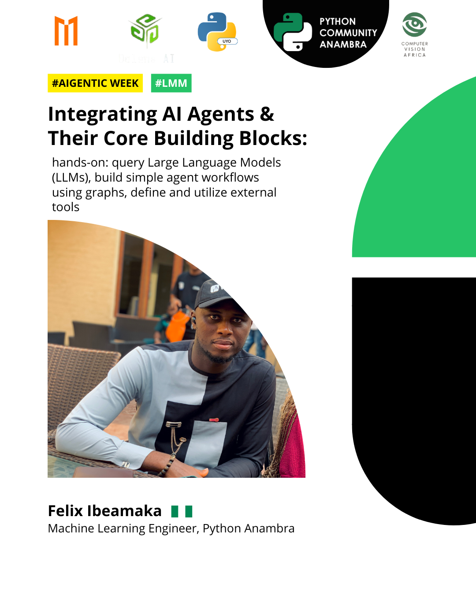

# Machine Learning Uyo - AI Agents Bootcamp 2025 - Day 2



## Integrating AI Agents & Their Core Building Blocks

Welcome to the Day 2 materials for the Machine Learning Uyo AI Agents Bootcamp 2025! This repository contains the code, notebooks, and resources from the session focused on understanding and integrating the core building blocks of AI Agents.

Following our introduction to AI Agents on Day 1, today we delved into the fundamental components that enable agents to perceive, think, and act. This session provided hands-on examples demonstrating how to query Large Language Models (LLMs), build simple agent workflows using graphs, define and utilize external tools, and incorporate basic reasoning capabilities into our agents.

---

## Session Recording

If you missed the live session or want to revisit the content, you can watch the recording here:

▶️ **Watch the Recorded Session (Day 2):** [Insert Day 2 YouTube Link Here]

---

## Session Overview

* **Topic:** Integrating AI Agents & Their Core Building Blocks
* **Date:** May 13, 2025 (Day 2 of the Bootcamp)
* **Speaker:** Felix Ibeamaka

---

## The Building Blocks of Agentic AI Systems

As discussed in the session, the key components that empower AI agents are:

* **Planning:** The ability to strategize and break down complex tasks into manageable steps.
* **Memory:** The capacity to retain and recall information from past interactions or external knowledge sources.
* **Tools:** External functions, APIs, or services that agents can call upon to perform specific actions or access information beyond their inherent capabilities.
* **Action:** The execution of tasks or interactions with the environment based on the agent's planning and tool utilization.

---

## Code Description

The code in this directory demonstrates the following concepts covered in the Day 2 session:

1.  **Querying LLMs:** Basic interaction with a Large Language Model (using OpenAI's API via `langchain_openai`) to get responses to prompts.
2.  **Building Simple Graphs:** Using `langgraph` to define basic agent workflows, illustrating how messages flow through different nodes (like an LLM call).
3.  **Defining and Using Tools:** Creating simple Python functions (`multiply`, `add`) and binding them to the LLM, enabling the agent to identify when to use these tools based on the user's request.
4.  **Building an Agent with Tools:** Constructing a graph where the agent can decide to call a tool based on the input message.
5.  **Adding Reasoning to the Agent:** Modifying the agent graph to allow the agent to process the output of a tool call and potentially use it in subsequent steps or to formulate a final response, demonstrating basic multi-step reasoning.

---

## Project Structure
```

day_2/
├── DAY 2_Integrating_AI_Agents\Intro to Agent.ipynb 
├── requirements.txt                                  

```
## Getting Started

To run the code from this session:

1.  **Clone the Repository:** If you haven't already, clone the main bootcamp repository:
    ```bash
    git clone https://github.com/Machine-Learning-Uyo-Community/Agentic-AI-Week.git
    ```
2.  **Navigate to Day 2:** Change into the `day_2` directory:
    ```bash
    cd DAY 2_Integrating_AI_Agents
    ```
3.  **Set up Environment:** Create and activate a Python virtual environment:
    ```bash
    python -m venv venv
    source venv/bin/activate # On Windows: venv\Scripts\activate
    ```
4.  **Install Dependencies:** Install the required libraries:
    ```bash
    pip install -r requirements.txt
    ```
5.  **Set API Keys:** You will need an API key for the LLM used (e.g., OpenAI). Follow the instructions provided in the session or notebook to set this up securely (e.g., using a `.env` file and `python-dotenv`).
    ```bash
    # Example: Create a .env file in the day_2 directory
    # OPENAI_API_KEY='your_openai_key_here'
    ```
6.  **Run the Code:** Execute the code within the provided Jupyter notebook or Python scripts to experiment with the concepts demonstrated.


## Assignments

Remember to complete the assignment for Day 2 to reinforce your learning and qualify for the bootcamp certificate. Assignment details will be provided separately or within the session materials. Submit your completed assignment via a Pull Request to the main bootcamp repository.

---

Let's continue building! 🚀
