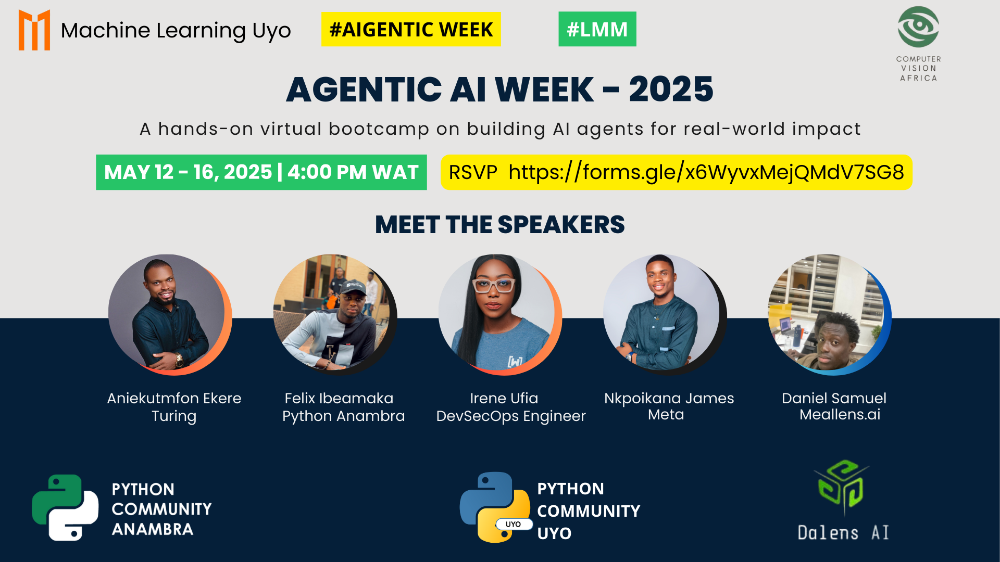

# Machine Learning Uyo - AI Agents Bootcamp 2025

## Building Scalable Agentic AI Systems for Real-World Impact

Welcome to the official GitHub repository for the Machine Learning Uyo AI Agents Bootcamp 2025! This repository serves as the central hub for all materials related to our 5-day intensive virtual hands-on training program. Here, you will find the code, notebooks, essential resources, and practical assignments designed to guide you through the process of building scalable AI agents.

This bootcamp is a collaborative effort, proudly organized by Machine Learning Uyo in partnership with several key developer and AI communities, including Python Community Uyo, Python Anambra, Py weekends Ibadan, Computer Vision Africa, and Dalens AI. Our collective expertise and resources are pooled to provide you with a comprehensive learning experience.

Our primary goal is to equip every participant with the practical, hands-on skills necessary to build production-ready AI agents. We achieve this by focusing on a project-based learning approach. Each day of the bootcamp is dedicated to building a complete, functional, and scalable AI agent from scratch, directly applying the concepts and techniques discussed during the live sessions.

---

## Bootcamp Goals

This bootcamp is structured around several core objectives designed to provide participants with a solid foundation and practical expertise in AI agent development:

* **Practical Skill Building:** To equip participants with the tangible coding and implementation skills required to build AI agents that are ready for production environments.
* **Tool Exploration & Utilization:** To provide hands-on experience with essential tools and libraries in the AI agent ecosystem, including LangChain for orchestration, APIs from providers like OpenAI and Google Gemini for leveraging Large Language Models (LLMs), Hugging Face for accessing models, and Python as the primary programming language.
* **Comprehensive Concept Coverage:** To cover essential theoretical and practical concepts underpinning AI agents, such as reasoning mechanisms, achieving autonomy, effectively integrating LLMs, incorporating computer vision capabilities, and developing planning abilities.
* **Reproducible & Scalable Architectures:** To share and demonstrate architectural patterns for building AI agents that are not only reproducible but also scalable to address real-world problems and larger datasets.
* **Community Collaboration & Contribution:** To foster a collaborative learning environment and encourage participants to contribute to open-source repositories, enhancing their skills and contributing to the broader AI community.

---

## Event Schedule

The bootcamp is structured over five consecutive days, with dedicated time slots for live sessions and hands-on work:

* **Date:** May 12th – 16th, 2025
* **Time:** 4:00 PM – 5:30 PM WAT daily
* **Platform:** Google Meet (The link to join the live sessions will be shared exclusively with registered participants via email and community channels).
* **Replay:** Recordings of each session will be uploaded to partner YouTube channels shortly after the live event concludes. Links to these replays will be added to this README and shared via community channels.
* **Codebase:** This GitHub repository will be updated daily with the code, notebooks, and resources covered in each session.

---

## Technologies & Tools

Throughout the bootcamp, we will be working extensively with a range of powerful tools and libraries that are standard in the field of AI agent development:

* **Python:** As the primary programming language, Python's extensive libraries and frameworks make it ideal for AI development.
* **Large Language Models (LLMs):** We will explore how to integrate and utilize state-of-the-art LLMs through APIs from providers such as OpenAI and Google Gemini to power agent capabilities like understanding, generation, and reasoning.
* **Frameworks (LangChain):** We will heavily utilize frameworks like LangChain, which provide modular abstractions and tools to simplify the orchestration and development of complex AI agent workflows.
* **Hugging Face:** This platform provides access to a vast collection of pre-trained models, including transformer models and potential vision models, which we may leverage for specific agent tasks.
* **Computer Vision Libraries:** Depending on the daily project, we may integrate computer vision capabilities using libraries such as OpenCV or other relevant tools for tasks involving image analysis and understanding.
* **Deployment Tools:** For deploying and making your AI agents accessible, we will explore tools like FastAPI for creating APIs, Streamlit for building interactive demos, and Docker for containerization and ensuring reproducible environments.
* **Version Control (Git and GitHub):** We will use Git for local version control and GitHub for collaborative development, code hosting, and managing contributions through Pull Requests.

---

## Getting Started

To ensure you can fully participate in the bootcamp and follow along with the hands-on coding sessions, please complete the following steps:

1.  **Register for the Bootcamp:** Ensure you have officially registered for the bootcamp via the provided registration form. This is crucial to receive the Google Meet session links and all important updates throughout the week: [https://forms.gle/ZSZX3e1k8WRrBUPX7](https://forms.gle/ZSZX3e1k8WRrBUPX7)
2.  **Clone the Repository:** Clone this GitHub repository to your local machine using the following command in your terminal:
    ```bash
    git clone https://github.com/Machine-Learning-Uyo-Community/Agentic-AI-Week.git
    ```
3.  **Set up Environment:** Navigate into the cloned repository directory. It is highly recommended to set up a Python virtual environment to manage dependencies for the bootcamp projects. Then, install the required libraries. Specific `requirements.txt` files with necessary dependencies will be provided within each daily project folder (`Agentic-AI-Week\Intro_to_Agents`, `Agentic-AI-Week\Deploying_AI_Agents/`, etc.).
    ```bash
    cd [your-cloned-repo-name]
    python -m venv venv
    source venv/bin/activate # On Windows, use `venv\Scripts\activate`
    # To install dependencies for a specific day (Agentic-AI-Week\Deploying_AI_Agents):
    # pip install -r Agentic-AI-Week\Deploying_AI_Agents/requirements.txt
    ```
4.  **Obtain API Keys:** Some of the daily projects will require access to APIs from LLM providers like OpenAI or Google Gemini. Instructions on how to obtain these API keys and configure them securely (e.g., using environment variables) will be provided during the relevant sessions. Please anticipate needing to set these up.

---

## Daily Projects

The bootcamp is structured around building a complete AI agent project each day. The content and code for each day's session and project will be organized in dedicated folders within this repository:

* **Day 1: Intro to Agentic Systems + Tools**
    * **Focus:** Understanding the fundamental concepts of AI agents, their architecture, and how they can utilize external tools to extend their capabilities using frameworks like LangChain.
    * **Agent Project:** The practical project for Day 1 will involve building a simple conversational agent that can effectively use one or more tools (e.g., performing a web search to answer questions, retrieving information from a document).
    * **Folder:** `Agentic-AI-Week\Intro_to_Agents/` (Look for notebooks, code files, and `requirements.txt` here)

* **Day 2: Planning & Reasoning Agents**
    * **Focus:** Exploring how AI agents can tackle more complex tasks by breaking them down into smaller steps and employing reasoning abilities to determine the best course of action.
    * **Agent Project:** Participants will develop an agent capable of task decomposition and implementing basic reasoning using techniques such as prompt chaining or other reasoning graph structures.
    * **Folder:** `Agentic-AI-Week\Intro_to_Agents/` (Look for notebooks, code files, and `requirements.txt` here)

* **Day 3: Autonomous Multi-Agent Systems**
    * **Focus:** Delving into the design and implementation of systems where multiple specialized agents interact and collaborate autonomously to achieve a larger, shared goal that a single agent might struggle with.
    * **Agent Project:** The project will involve creating a multi-agent ecosystem. Examples could include agents specializing in tasks like parsing different file types, summarizing information, or retrieving specific data, working together in a pipeline or network.
    * **Folder:** `Agentic-AI-Week\Deploying_AI_Agents/` (Look for notebooks, code files, and `requirements.txt` here)

* **Day 4: Computer Vision + Agent Integration**
    * **Focus:** Learning how to integrate computer vision capabilities into AI agents, allowing them to process and understand visual information as part of their decision-making or task execution.
    * **Agent Project:** Participants will build an image analysis agent. This agent will utilize vision models (potentially from platforms like Hugging Face or libraries like OpenCV) to perform tasks such as image classification, object detection, or extracting information from images.
    * **Folder:** `day_4/` (Look for notebooks, code files, and `requirements.txt` here)

* **Day 5: Deployment & Scaling Agents**
    * **Focus:** Covering the essential steps and considerations for taking your developed AI agents from a local environment to a production setting, including deployment strategies and thinking about how to scale for real-time usage and increased load.
    * **Agent Project:** The final project will involve deploying a previously built agent (or a simplified version) using popular tools like FastAPI for creating a web API, Streamlit for a simple interactive demo, and Docker for containerization to ensure portability and reproducible deployment.
    * **Folder:** `day_5/` (Look for code files, Dockerfiles, and deployment scripts here)

---

## Assignments & Contributions

To successfully complete the bootcamp and earn your certificate, active participation and completion of assignments are key.

* **Follow-up Assignments:** For each day's session, a practical follow-up assignment will be provided. These tasks are carefully designed to reinforce the concepts and building techniques covered during the live coding session. Completing these assignments is crucial for solidifying your understanding.
* **Submitting Assignments:** All assignments must be submitted via **Pull Requests (PRs)** to this main bootcamp repository. The process is as follows:
    1.  **Fork** this repository to your own personal GitHub account.
    2.  Complete the assignment within your forked repository, making sure to place the code/notebooks in the appropriate daily folder structure.
    3.  Create a **Pull Request** from your forked repository back to the `main` branch of this official bootcamp repository.
    4.  Ensure your Pull Request title and description clearly indicate which day's assignment you are submitting (e.g., "Assignment Day 1: Simple Conversational Agent").
* **Contributing to Projects:** We highly encourage participants to go beyond just assignments and contribute improvements, bug fixes, or even alternative implementations to the daily project code. Contributions should also be submitted via Pull Requests and should adhere to the repository's license and contribution guidelines.
* **Certificate Requirement:** Successful completion and submission of the required daily assignments (via reviewed Pull Requests) is a mandatory requirement to qualify for the official AI Agents Bootcamp 2025 certificate of completion.

---

## Community & Support

Joining our community channels is essential for staying updated, getting support, and interacting with speakers and fellow participants throughout the bootcamp:

* **Google Groups:** [https://groups.google.com/g/ML-uyo/about](https://groups.google.com/g/ML-uyo/about) - This is a primary channel for important announcements, sharing resources, and engaging in broader discussions. Please ensure you are a member.
* **WhatsApp Group:** [https://chat.whatsapp.com/GQnlP41HqOoCjuuK4wSgFM](https://chat.whatsapp.com/GQnlP41HqOoCjuuK4wSgFM) - Join this group for real-time interaction, quick questions, and connecting with other participants.
* **Twitter:** [https://x.com/TFUGUyo](https://x.com/TFUGUyo) - Follow our Twitter handle for updates, highlights, and announcements related to the bootcamp and other community activities.
* **LinkedIn:** [https://www.linkedin.com/in/machine-learning-uyo-bb291430b/](https://www.linkedin.com/in/machine-learning-uyo-bb291430b/) - Connect with the Machine Learning Uyo community on LinkedIn to stay informed and network.
* **YouTube:** [https://lnkd.in/d7-_dW6Q](https://lnkd.in/d7-_dW6Q) - Session replays will be available here and on our partner communities' YouTube channels.

---

## Speakers

We are excited to have a lineup of experienced speakers and experts who will be guiding us through the daily projects and concepts. Speaker details will be updated here as they are confirmed for each session.

* **May 12:** Felix Ibeamaka - Intro to LLM-powered Agents


 Speaker slots are still open! If you are knowledgeable in AI Agents and would like to contribute by leading a session, please fill out our speaker call form: [https://forms.gle/KhPoskwPE9udUpVY6](https://forms.gle/KhPoskwPE9udUpVY6)

---

## Partner Communities

This bootcamp is a testament to the power of community collaboration. We are proud to partner with these fantastic developer and AI communities:

* Machine Learning Uyo
* Python Community Uyo
* Python Anambra
* Py weekends Ibadan
* Computer Vision Africa
* Dalens AI
* MealLens.ai

We encourage you to explore and engage with these communities as well!

---

## License

The code and materials in this repository are licensed under the MIT License. This means you are free to use, copy, modify, merge, publish, distribute copies of the software, provided you include the original copyright and permission notice. See the [LICENSE](LICENSE) file for full details.

---

## Contact

For any inquiries, questions, or support regarding the AI Agents Bootcamp 2025, please feel free to contact:

Machine Learning Uyo
tensorflowcommunityuyo@gmail.com

---

Let's learn, build, and innovate together! Get ready to build some amazing AI Agents! 🚀
